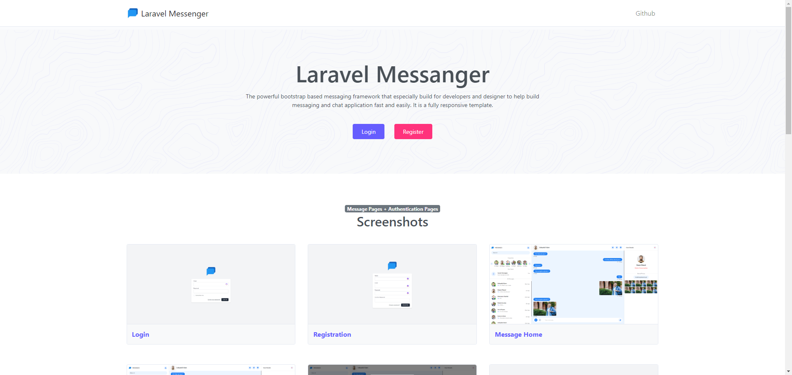

## Laravel Messanger

<p align="center">
 
</p>

## Instruction for running this application


### Prerequisites

Before using these scripts, ensure you have the following installed:

- **Git**: Install Git on your workspace to clone this repository.

- **PHP**: Install PHP on your workspace to for manipulate PHP file.

- **Composer**: Install composer for managing php packages.

- **NodeJS & NPM**: Install Nodejs and NPM on your workspace to run nodejs module.

- **MySQL Server**: Make sure MySQL server is installed on your workspace for store data .

### Installation

1. Clone this repository to your local machine:

    ```bash
    git clone https://github.com/rpsohag/laravel-messenger.git laravel-messenger
    ```
2. go to laravel-messenger directory:

    ```bash
    cd laravel-messenger
    ```
3. Clone this repository to your local machine:

    ```bash
    composer install
    ```
4. generate .env file:

    ```bash
    cp .env.example .env
    ```
5. generate application key:

    ```bash
    php artisan key:generate
    ```
6. database connection:

    > ```
    >DB_CONNECTION=mysql
    >DB_HOST=127.0.0.1
    >DB_PORT=3306
    >DB_DATABASE=your database name
    >DB_USERNAME=your database username
    >DB_PASSWORD=your database password
    > ```
7. run this application:

     ```bash
    php artisan serve
    ```

## Tech Stack

**Client Side:** Bootstrap 5.3.2

**Server Side:** PHP, Laravel, Pusher

## Support

For support, [contact me](https://www.linkedin.com/in/rpsohagwdd/) or open an issue.